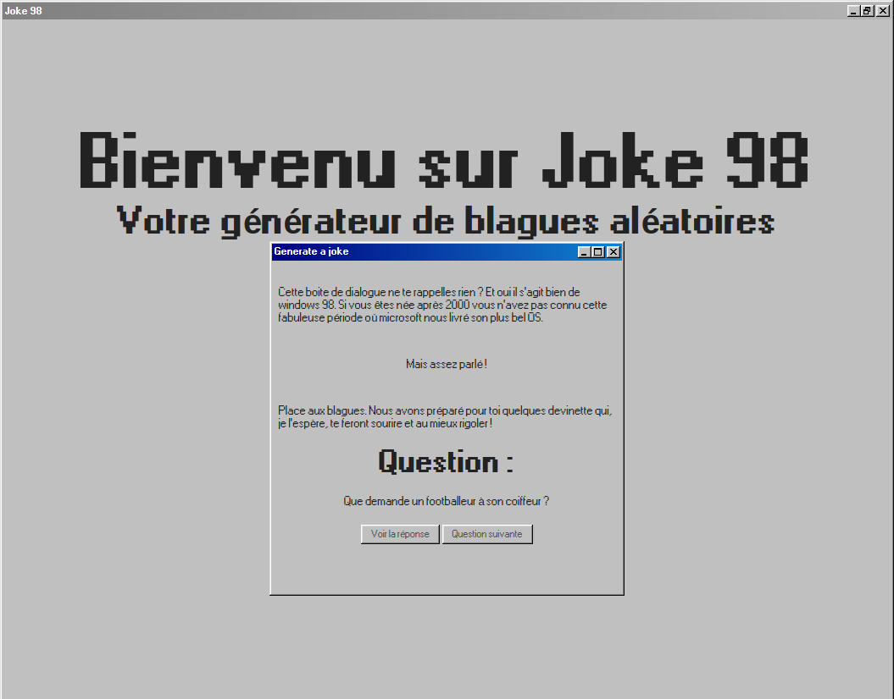

# Joke 98

Petite application en __PHP__, __Javascript__, __CSS3__ et __HTML5__.

## L'idée du projet

Au détour d'internet, je suis tombé sur un projet CSS reprenant le style de Windows 98. Cherchant également une petite API, j'ai trouvé un générateur de blagues, et en Français !

Pourquoi ne pas les associer ?

Voici donc l'aperçu de l'application dans sa version final

<p align="center">
    
</p>

## Explication du code

Le corps de l'application repose sur la consommation de l'API du site [blague.xyz](https://blague.xyz). L'accès à l'API est géré par le fichier getData.php et de la fonction getJoke().
Le résultat de cette fonction renvoi une blague aléatoire exploitable dans l'index.php du site.

## L'index

Le style Windows 98 est récupéré directement dans le HEAD du site avec la balise ci-dessous :

```HTML
    <link  rel="stylesheet"  href="https://unpkg.com/98.css">
```

Le site est ensuite articulé autour de deux fenêtres, la principale, et celle contenant la blague à deviner.

Une troisième simulant la diminution de la fenêtre.

## Les fenêtres Windows

La fenêtre contenant la blague a deviner est utilisable comme sur un bon vieux Windows 98. Vous pouvez l'agrandir, la diminuer et la bouger à l'aide du script ci-dessous :

```Javascript
//Initialisation des coordonnées pour le déplacement de la fenetre maxi
let x = 0;
let y = 0;
iteration = 0


//Fonction bougeant la fenetre
function toMove(e) {
    maxi.classList.add('moving');
    main.onmousemove = function(evt){
        console.log("i = " + iteration);
        
        if (iteration == 0) {
            x = evt.clientX
            y = evt.clientY
            console.log("x : " + x);
            console.log("y : " + y);
            
        } else {
            coordX = evt.clientX - x
            coordY = evt.clientY - y
            console.log("x : " + coordX);
            console.log("y : " + coordY);

            maxi.style.left = coordX + "px";
            maxi.style.top = coordY + "px";
        }
        iteration++;
    }
}
```
## La blague

Nous récupérons la variable $data contenant notre blague extraite précédemment de l'API du site [blague.xyz](https://blague.xyz).

La question est inséré dans le HTML à l'aide d'une balise __PHP__ :

```HTML
 <p><?= $data['question'] ?></p>
```

A vous maintenant de deviner la réponse, sinon vous pouvez la faire apparaitre en cliquant sur le bouton "Voir la réponse".

On récupére la réponse à l'aide du code ci-dessous dans la page __HTML__ :

```HTML
<p class="response non-active"><?= $data['answer'] ?></p>
```

Ici nous ajoutons une classe "non-active" afin de cacher la réponse, et la retirons pour laisser apparaitre la réponse lors du clique sur le bouton. L'ajout et la suppression de la classe "non-active" se fait en __Javascript__ :

```Javascript
const answer = () => {
    btn.classList.toggle('non-active');
    btn.classList.toggle('active');
}
```